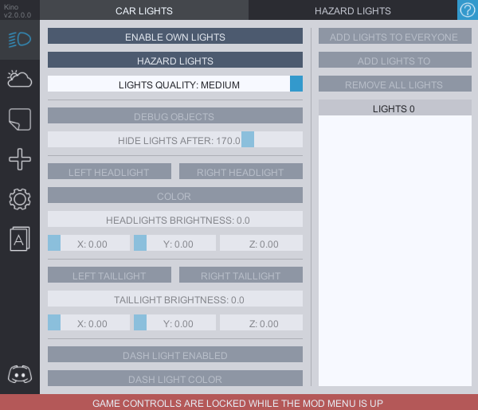
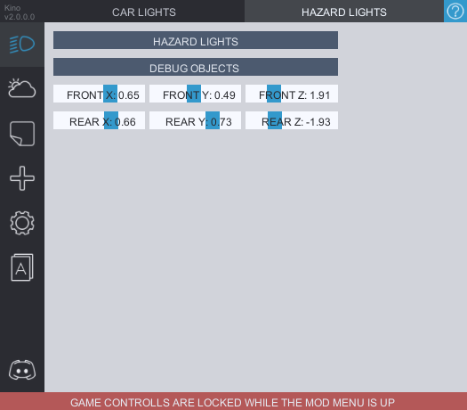

# Car Lights
Tab with setting for your headlights and tail lights. From here you can add lights to your car, cars of other players in the lobby and change their settings.
Lights are pre-configured for all the cars, however depending on the bodykit you might want to change the position settings for a better fit. Light settings are synced between players who have the mod.

**HIDE LIGHTS AFTER** is the distance after which the lights will be hidden. This is an option so save you FPS if you're experiencing performance issues with too many lights on the track.

**ENABLE OWN LIGHTS** will add lights to your own car, after that the option to edit their brightness, position and color will be unlocked. You can use ***debug objects*** to see the position of the light source to help you with configuring them.

**ADD LIGHTS TO EVERYONE** works as a toggle and will automatically add lights to every player in the lobby. The lights settings of the mod users are synced so all the changes they do to their light brightness, color or position will be seen on your screen as well.

**HAZARD LIGHTS** enables the hazards, you can change their options in the ***HAZARD LIGHTS*** tab.
