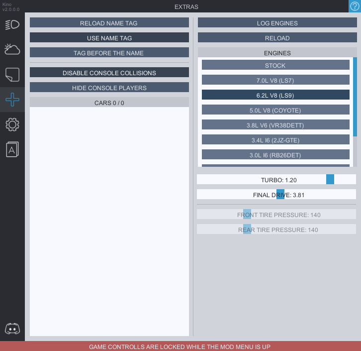

# Extras
The tab that you get access to as a "thank you" to our supporters.  
To use the custom name tag, put it inside the ***tag.txt*** file located at ***CarX Drift Racing Online\BepInEx\plugins\KN_Base***  
You can use color codes by writing **hex codes** without the # (Example: [ffffff] for white color)

**RELOAD NAME TAG** will reaload the tag so you don't have to restart the game if you make any changes to it. **(only works in the garage)**

**TAG BEFORE THE NAME/TAG AFTER THE NAME** is a toggle that allows you to either put your tag at the start or at the end of your nickname.

## Player collision disabling/hiding  
You can automatically disable collisons or hide console players as well as disable collisions with unwanted players from the list.

## Engine swaps
Swaps is the experimental feature avaliable currently only as a part of extras.  
Keep in mind that you can only apply them from the garage. Since they don't work with the dyno you have options to adjust turbo and final drive from the menu. Both are saved per every engine and the car.

**LOG ENGINES** button will log all the engines of other players in the lobby inside the console. This is purely for competition organizers. 

**RELOAD** in case something stops working, you can try reloading the mod. Might help (or might not).

You can also change **tire pressure** on the go from the menu. Doesn't work in the garage.