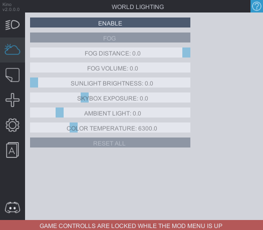

# World Lighting
In this tab you can **enable** the sliders to change the lighting settings such as the brightness of sunligh, skybox and ambient light as well the color temperature.

**Fog** can has the options to configre the ***fog distance*** which is how far from the camera the fog will be, and the ***fog volume*** which is basically the thickness of the fog. Affects the look of the lights.