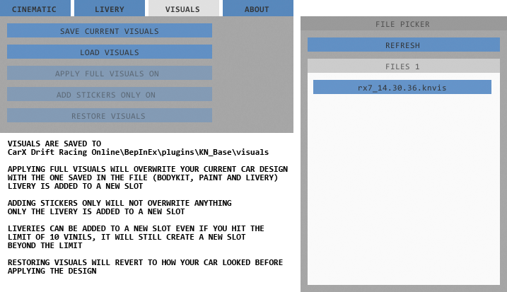
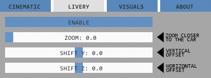

# KINO
 
### Required: [BepInEx mod loader](https://github.com/BepInEx/BepInEx/releases)
## About
This mod consists of multiple modules with the main focus on it's replay feature allowing you to record as many cars as you want in multiplayer and then playing them back whenever you want. The mod also gives you the ability to create custom cameras along with animating them.

Besides the main features mod also has livery sharing and a module that allows you to offset your camera in garage to help you with creating liveries.

### Modules
* Cinematic  
Main focus of this module is it's replay feature to record and playback your multiplayer runs with up to 16 cars. It also allows you to create and animate custom cameras via keyframes.
* Livery Share  
What the name suggests. Allows you to save your car's design to a file that can be shared and later either apply the whole design (along with bodykit, wheels, paint and livery) or apply livery only. Liveries are placed in a new slot so you can add them even if you hit the limit on your vinyls slots.
* Livery Camera  
Simply allows you to offset the camera vertically, horizontally or bring it closer to the car to make livery creation a bit easier.

### How to use
Press F4 to bring up the menu
- Cinematic  
Consists of 3 tabs:  
### First tab allows for creating custom cameras, hooking them to a chosen car and setting a target for following.   
  
### Second tab has all the keyframes you added via timeline where you can edit, duplicate or delete them.  
  
### Third tab is where you can pick the players whose cars you wish to record and load your saved replays.  
  
### Timeline appears at the bottom of the screen when you enable cinematic mode.
There you can set the starting and the ending points of your replay.  
  

- Livery Share  
  

- Livery camera  

## Instalation
1. Install BepInEx mod loader if you haven't already  
Extract files from BepInEx zip into your CarX Drift Racing Online folder
2. Put the .dll files inside the kino.zip inside:   
CarX Drift Racing Online\BepInEx\plugins  