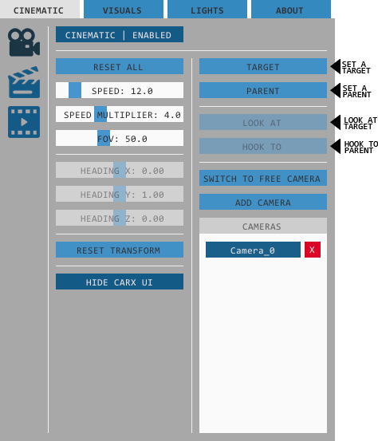
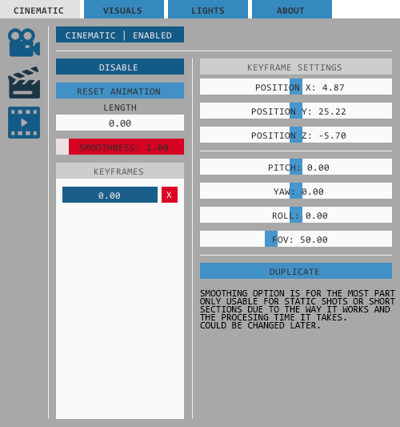
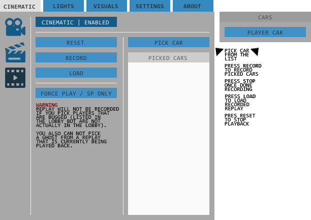
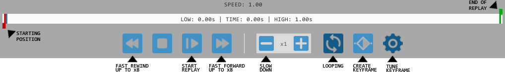
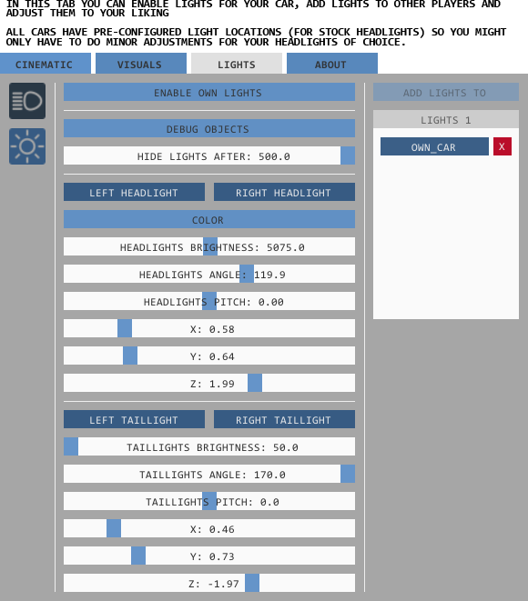
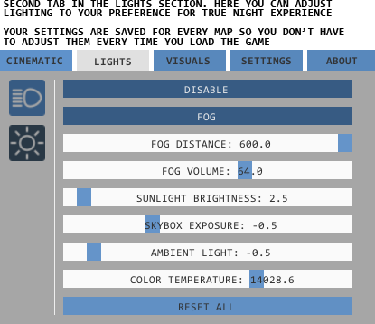
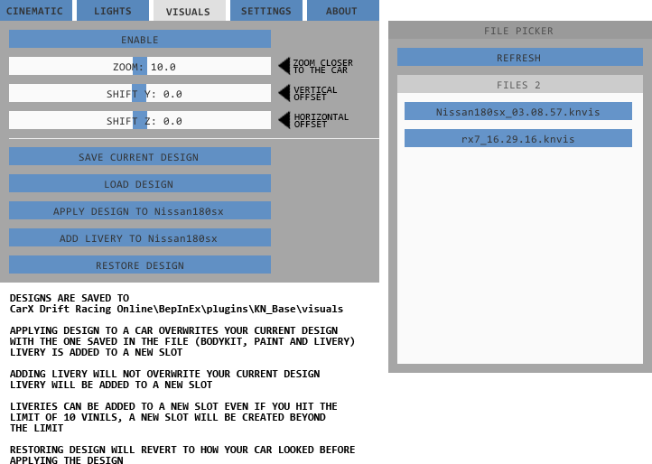
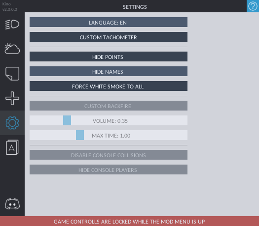

#
 

### Required: [BepInEx mod loader](https://github.com/BepInEx/BepInEx/releases)
## About
This mod consists of multiple modules such as cinematic that is mainly based around the ability to record replays and playing them back at any moment, custom lights, and livery sharing. The mod also has multiple small side features to enhance your experience.

### Modules
* Cinematic  
Main focus of this module is it's replay feature to record and playback your multiplayer runs with up to 16 cars. It also allows you to create and animate custom cameras via keyframes.
* Lights  
Lights for your car with pre-configured locations for both your headlights and tail lights. You can also add lights to other players' cars and tweak the lights to your liking.
This module also has sliders to configure world lighting to create gloomy weather or a dark night.
* Visuals
Allows for saving your liveries for copying (in case you want to experiment on it without risking unwanted changes being saved), creating backups (you never know when your profile can get reset for no reason), or sharing them with other players.  
Also gives the ability to offset the camera in livery editor for easier livery creation.

### How to use
Press F4 to bring up the menu
- Cinematic  
Consists of 3 tabs:  
### First tab allows for creating custom cameras, hooking them to a chosen car and setting a target for following.   
  
### Second tab has all the keyframes you added via timeline where you can edit, duplicate or delete them.  
  
### Third tab is where you can pick the players whose cars you wish to record and load your saved replays.  
  
### Timeline appears at the bottom of the screen when you enable cinematic mode.
There you can set the starting and the ending points of your replay.  
  

## Lights
  

##  

## Visuals

  

## Settings
Right now this tab has toggles for points counter and player nicknames  
More options will be added to this tab in the future.
  

## Config
Inside your CarX Drift Racing Online\BepInEx\plugins\KN_Base folder you will find a kn_config.xml file that you can open with either notepad or notepad++ (recommended) where you can change the keybinds to your prefered buttons.

## Installation
1. Install [BepInEx mod loader](https://github.com/BepInEx/BepInEx/releases) if you haven't already  
Extract files from BepInEx zip into your CarX Drift Racing Online folder
2. Download the latest version from [release tab](https://github.com/trbflxr/kino/releases). Put the .dll files from the release_%version_name%.zip inside:   
CarX Drift Racing Online\BepInEx\plugins
(if you didn't have mod loader before and don't have the folder then either create it yourself or launch the game once for it to be created automatically) 

## Roadmap
- Improving UI along with adding Dark Mode
- Possibly adding other small features  

## Feedback
Forward all the bugs to the issues tab or in a specified channel in Discord
Suggestions can also be left in the dedicated channel in Discord

## If you feel like supporting mod's development you can 
